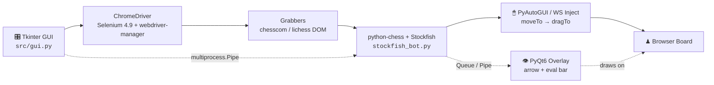
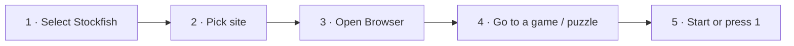

<div align="center">


# Chess‑X

### Stockfish‑powered automation for chess.com & lichess.org

*Live board scraping · engine analysis · transparent overlay · mouse & mouseless play*

<br />

[](https://www.python.org/downloads/)
[](https://stockfishchess.org/)
[](LICENSE)
[]()

[](https://github.com/Ifaz2611/chess-X/actions)
[](https://github.com/Ifaz2611/chess-X/stargazers)
[](https://github.com/Ifaz2611/chess-X/issues)
[](CONTRIBUTING.md)

<br />


<br /><br />

[**Install**](#-installation) · [**Quick Start**](#-quick-start) · [**Usage**](#-usage) · [**Configuration**](#-configuration) · [**Troubleshooting**](#-troubleshooting) · [**Roadmap**](#-roadmap)

</div>

---

> [!CAUTION]
> **Educational use only.** Running this bot against human opponents on chess.com or lichess.org violates their fair‑play policies and **will** get your account banned. Use it against bots, on puzzles, in analysis, or on your own boards. See the [Disclaimer](#-disclaimer).

<br />

## What is Chess‑X?

Chess‑X watches a live browser board, feeds the position to **Stockfish** through `python-chess`, and plays the engine's best move — either by driving the real cursor with `PyAutoGUI` or by injecting moves straight into Lichess' WebSocket (no cursor movement at all). A transparent **PyQt6** overlay draws the best‑move arrow and a live evaluation bar on top of the board.

<table>
<tr>
<td width="33%" valign="top">

### Engine
Full Stockfish tuning — skill, depth, slow‑mover — with auto‑managed hash and threads.

</td>
<td width="33%" valign="top">

### Overlay
Click‑through, always‑on‑top arrow + sigmoid‑scaled eval bar aligned to the board.

</td>
<td width="33%" valign="top">

### Control
Tkinter panel, global hotkeys, PGN export, and live accuracy / WDL / material tracking.

</td>
</tr>
</table>

<br />

<details>
<summary><b>Table of Contents</b></summary>

- [How It Works](#-how-it-works)
- [Features](#-features)
- [Tech Stack](#-tech-stack)
- [Project Structure](#-project-structure)
- [Installation](#-installation)
- [Quick Start](#-quick-start)
- [Usage](#-usage)
- [Configuration](#-configuration)
- [GUI Reference](#-gui-reference)
- [Stockfish Parameters](#-stockfish-parameters)
- [Keyboard Shortcuts](#-keyboard-shortcuts)
- [Overlay & Evaluation](#-overlay--evaluation)
- [Troubleshooting](#-troubleshooting)
- [FAQ](#-faq)
- [Roadmap](#-roadmap)
- [Development](#-development)
- [Testing](#-testing)
- [Contributing](#-contributing)
- [Security & Fair Play](#-security--fair-play)
- [Acknowledgements](#-acknowledgements)
- [Disclaimer](#-disclaimer)
- [License](#-license)

</details>

---

## How It Works



| # | Stage | Module | What happens |
|:-:|---|---|---|
| 1 | **Control** | `src/gui.py:18` | Pick Stockfish binary, target site, engine tuning. Manages two child processes over `Pipe` + `Queue`. |
| 2 | **Browser** | `src/gui.py:536` | Launches ChromeDriver, navigates to the site, hands the session URL + ID to the bot process. |
| 3 | **Grab** | `src/grabbers/*` | Site‑specific DOM scraping: `get_board()`, `get_move_list()`, `is_white()`, game‑over detection. Attaches via `attach_to_session`. |
| 4 | **Think** | `src/stockfish_bot.py:15` | Syncs SAN moves into a `chess.Board`, calls `get_best_move()` with configured depth/skill/threads/hash. Handles promotion, manual/mouseless. |
| 5 | **Act** | `src/stockfish_bot.py:75` | Maps UCI squares → screen pixels with board‑flip compensation, then drags (or sends `lichess.socket.ws`). Respects `mouse_latency`. |
| 6 | **Render** | `src/overlay.py:9` | Transparent click‑through window draws a `QPolygon` arrow and a board‑aligned eval bar. |

---

## Features

| Category | Feature | chess.com | lichess.org | Notes |
|---|---|:-:|:-:|---|
| **Platform** | Windows / Linux | ✅ | ✅ | macOS untested |
| **Opponents** | vs Human (online) | ✅ | ✅ | *Not permitted — see disclaimer* |
| | vs Bots | ✅ | ✅ | |
| **Puzzles** | Auto‑solve + non‑stop | ❌ | ✅ | `Non-stop puzzles` |
| **Modes** | Manual (hold `3`) | ✅ | ✅ | Shows arrow, waits for key |
| | Mouseless (background) | ❌ | ✅ | WebSocket injection, works minimized |
| | Non‑stop online matches | ❌ | ✅ | Auto‑clicks `New opponent` |
| **Tuning** | Mouse latency `0–15s` | ✅ | ✅ | `0.2s` steps |
| | Skill `0–20` | ✅ | ✅ | Stockfish `Skill Level` |
| | Depth `1–20` | ✅ | ✅ | Search depth |
| | Slow Mover `10–1000` | ✅ | ✅ | Default `100` |
| | Hash / Threads | Auto | Auto | Auto‑managed |
| **Analytics** | PGN export | ✅ | ✅ | `Export PGN` |
| | Live eval (cp / mate) | ✅ | ✅ | GUI + overlay bar |
| | W/D/L % | ✅ | ✅ | `get_wdl_stats()` |
| | Material count | ✅ | ✅ | `+3` / `-2` / `0` |
| | Accuracy tracking | ✅ | ✅ | Bot vs opponent |
| **UI** | Eval bar overlay | ✅ | ✅ | Sigmoid‑scaled |
| | Best‑move arrow | ✅ | ✅ | Red translucent polygon |
| | Move list treeview | ✅ | ✅ | Auto‑scroll |
| | Always on top | ✅ | ✅ | Toggleable |

---

## Tech Stack

<div align="center">


</div>

| Layer | Library | Version | Purpose |
|---|---|---|---|
| **Automation** | `selenium` | `4.9.1` | ChromeDriver control |
| | `webdriver-manager` | `4.0.1` | Driver auto‑download |
| | `PyAutoGUI` | `0.9.53` | `moveTo` / `dragTo` / `click` |
| | `keyboard` | `0.13.5` | Global hotkeys `1` `2` `3` |
| **Engine** | `stockfish` | `3.28.0` | UCI wrapper |
| | `chess` | `1.10.0` | Board, SAN/UCI |
| **IPC** | `multiprocess` | `0.70.14` | `Process` + `Pipe` + `Queue` |
| **UI** | `PyQt6` | `6.9.0` | Transparent overlay |
| | `tkinter` | stdlib | Control GUI (`ttk` clam) |
| **Util** | `packaging` | `24.0` | Dependency helper |

Stockfish itself is **not bundled** — grab a binary from [stockfishchess.org](https://stockfishchess.org/download/).

---

## Project Structure

<details>
<summary><b>Expand the tree</b></summary>

```
chess-X/
├── src/
│   ├── gui.py                      # Tkinter orchestrator (delegates to extracted modules)
│   ├── stockfish_bot.py            # Facade over BoardSync / EngineService / MoveExecutor / GameLoop
│   ├── config_store.py             # Versioned Config (v2) — single source of truth, migrate/validate
│   ├── protocol.py                 # Typed dataclass IPC (Pipe/Queue) — replaces ad-hoc strings
│   ├── browser_session.py          # ChromeDriver lifecycle (WD-manager + Selenium Manager, atexit)
│   ├── hotkeys.py                  # HotkeyManager
│   ├── controls.py / eval_panel.py # GUI controls & eval bar helpers
│   ├── board_sync.py               # DOM <-> chess.Board, takeback / FEN resync
│   ├── engine_service.py           # Stockfish settings, cp-loss accuracy, material
│   ├── move_executor.py            # Square -> screen mapping, promotion clicks
│   ├── game_loop.py                # Loop state helpers
│   ├── analysis.py                 # PGN import, eval, accuracy
│   ├── puzzle_trainer.py           # Hint / reveal-after-attempt trainer
│   ├── local_board.py              # Offline python-chess vs-engine board
│   ├── overlay.py                  # PyQt6 transparent overlay
│   ├── utilities.py                # logging, retry, attach_to_session, keyboard helpers
│   ├── grabbers/
│   │   ├── grabber.py              # Abstract Grabber + health_check with fallback warning
│   │   ├── chesscom_grabber.py     # chess.com selectors
│   │   └── lichess_grabber.py      # lichess selectors
│   └── assets/pawn_32x32.png
├── tests/
│   ├── fixtures/chesscom.html, lichess.html
│   ├── test_board_sync.py          # new game / takeback / FEN / promotion / mate + config migration
│   └── test_config.py, test_grabbers.py, ...
├── .github/workflows/ci.yml        # Windows + Linux × Py 3.10–3.12, pytest-cov, ruff, mypy
├── pyproject.toml                  # PEP 517, deps, ruff / mypy / pytest config
└── requirements.txt · run.bat · TODO.md · LICENSE
```

</details>

---

## Installation

### Prerequisites

| Requirement | Notes |
|---|---|
| **Google Chrome** | Chromium works but is untested |
| **Python 3.10+** | with `pip` |
| **Stockfish binary** | [Download](https://stockfishchess.org/download/) · Linux: `chmod +x stockfish` |

<details open>
<summary><b>Windows</b></summary>

```powershell
git clone https://github.com/Ifaz2611/chess-X
cd chess-X

python -m venv venv
venv\Scripts\pip.exe install -r requirements.txt
venv\Scripts\python.exe src\gui.py
```

Or just double‑click **`run.bat`**.

</details>

<details>
<summary><b>Linux / macOS</b></summary>

```bash
git clone https://github.com/Ifaz2611/chess-X
cd chess-X

python3 -m venv venv
venv/bin/pip install -r requirements.txt
venv/bin/python3 src/gui.py
```

> [!TIP]
> On Wayland, PyAutoGUI and the overlay may misbehave. Switch to X11/Xorg or export `QT_QPA_PLATFORM=xcb`.

</details>

---

## Quick Start



1. **Select Stockfish** → choose the binary you downloaded.
2. Pick **Chess.com** or **Lichess.org**.
3. Click **Open Browser** and log in if needed.
4. Navigate to a bot game, analysis board, or Lichess puzzle.
5. Hit **Start** (or press `1`). The status label turns green.

---

## Usage

| Step | Action |
|:-:|---|
| 1 | Run `src/gui.py` — the always‑on‑top control panel appears |
| 2 | **Select Stockfish** → point to the engine executable |
| 3 | Choose the target site via the radio buttons |
| 4 | *(Optional)* tune skill, depth, slow mover, latency and modes |
| 5 | **Open Browser** → ChromeDriver opens the site |
| 6 | Navigate to a live game or puzzle |
| 7 | **Start** / `1` → status turns green: `Running` |
| 8 | Watch the arrow + eval bar; the bot plays automatically |
| 9 | **Stop** / `2` to pause; press Start again to resume |

**PGN export:** click **Export PGN** at any point to write SAN notation to a `.pgn` file.

---

## Configuration

> [!IMPORTANT]
> Settings are currently **not persisted** between restarts. Config persistence is tracked in [TODO.md](TODO.md).

<details>
<summary><b>GUI settings</b></summary>

| Setting | Control | Range / Default | Notes |
|---|---|---|---|
| Stockfish path | File picker | — | Must be executable |
| Site | Radio | `chesscom` | Determines grabber class |
| Manual Mode | Checkbox | off | Requires `3` to execute |
| Mouseless Mode | Checkbox | off | Lichess only |
| Non‑stop puzzles | Checkbox | off | Lichess only |
| Non‑stop online matches | Checkbox | off | Lichess only |
| Mouse Latency | Slider | `0.0`–`15.0s` | Sleep before `dragTo` |
| Skill Level | Slider | `0`–`20` | Stockfish skill |
| Depth | Slider | `1`–`20` | Search depth |
| Slow Mover | Entry | `10`–`1000` | Default `100` |
| Always on top | Checkbox | on | Tkinter `-topmost` |

</details>

<details>
<summary><b>Environment variables</b></summary>

| Variable | Default | Purpose |
|---|---|---|
| `QT_QPA_PLATFORM` | system | Set to `xcb` if the overlay fails on Wayland |
| `CHROME_BIN` | auto | Chrome/Chromium binary override |
| `STOCKFISH_PATH` | GUI‑selected | Optional default engine path |

</details>

---

## GUI Reference

<details>
<summary><b>Every control, explained</b></summary>

| Control | Type | Default | Description |
|---|---|---|---|
| `Status` | label | `Inactive` 🔴 | `Running` 🟢 when the bot loop is active |
| `Eval / WDL / Material / Bot Acc / Opponent Acc` | labels | `-` | Live from `send_eval_data()`, updated each half‑move |
| `Chess.com` / `Lichess.org` | radio | `chesscom` | Selects the grabber class |
| `Open Browser` | button | — | Spawns ChromeDriver; disables afterwards |
| `Start` / `Stop` | button | `Start` | Spawns or kills `StockfishBot` + overlay processes |
| `Manual Mode` | checkbox | off | Shows the arrow and waits for `hold 3` |
| `Mouseless Mode` | checkbox | off | Lichess only — plays via `lichess.socket.ws.send` |
| `Non-stop puzzles` | checkbox | off | Lichess only — auto `Continue training` |
| `Non-stop online matches` | checkbox | off | Lichess only — auto `New opponent` |
| `Mouse Latency` | scale | `0.0` | `time.sleep` before `dragTo` |
| `Slow Mover` | entry | `100` | Stockfish `Slow Mover` UCI option |
| `Skill Level` | scale | `20` | Stockfish skill |
| `Depth` | scale | `15` | Search depth |
| `Window stays on top` | checkbox | on | `master.attributes("-topmost", ...)` |
| Move treeview | table | — | Auto‑scrolled SAN history (`# / White / Black`) |
| `Export PGN` | button | — | Writes `1. e4 c5 2. Nf3 ...` to file |

</details>

---

## Stockfish Parameters

| Param | UCI name | Range | Effect |
|---|---|:-:|---|
| **Skill Level** | `Skill Level` | `0–20` | Artificially weakens play. `20` = full strength; lower values inject deliberate blunders. |
| **Depth** | `depth` | `1–20` | Plies searched. Higher = stronger but slower. `20` can stall weak CPUs. |
| **Slow Mover** | `Slow Mover` | `10–1000` | Time‑management bias. `10` rushes, `100` default, `500+` favours quality. |

*Hash* (512 MB) and *Threads* (auto‑detected cores) are managed automatically and no longer exposed.

> [!TIP]
> **Human‑like:** `Skill 8–12` + `Depth 10–12` + `Slow Mover 80`
> **Analysis:** `Skill 20` + `Depth 18–20`

---

## ⌨Keyboard Shortcuts

<div align="center">

| Key | Action | Condition |
|:-:|---|---|
| <kbd>1</kbd> | **Start** the bot | Browser must be open |
| <kbd>2</kbd> | **Stop** the bot | Anytime |
| <kbd>3</kbd> | **Execute** next move | Manual Mode only (hold or tap) |

</div>

> [!NOTE]
> On Linux, global hooks may need elevated access:
> `sudo usermod -aG input $USER` then re‑login — or run the app with `sudo`.

---

## Overlay & Evaluation

- **Arrow** — red translucent `QPolygon` from source to target square centre (`overlay.py:244`). Visible during manual mode and think time.
- **Eval bar** — vertical bar left of the board (`overlay.py:147`):
  - Height = board height · width `40px` · margin `15px`
  - Centipawns mapped through a sigmoid: `1 / (1 + exp(-value * 0.5))`, clamped `±10`
  - Mate → full (`1.0`) or empty (`0.0`) bar
  - Colours flip with `is_white`, so the bottom is always *your* side
  - Label shows `+1.23` · `M3` · `M-2`
- **GUI labels** — `Eval`, `WDL` (win/draw/loss %), `Material` (`+3`), and `Bot Acc` / `Opponent Acc` (SAN match % vs `get_best_move_time(300)`).

---

## Troubleshooting

<details open>
<summary><b>Common issues</b></summary>

| Symptom | Cause → Fix |
|---|---|
| `Can't find Chrome` | Install Google Chrome. Driver version is auto‑managed by `webdriver-manager`. |
| `Stockfish path is not valid` | Re‑select the binary. Linux: `chmod +x stockfish`, confirm `file stockfish` shows ELF. |
| `Can't find board / color / moves` | Site DOM changed or wrong page. Ensure you're on a live game or puzzle, then update selectors in the grabbers. |
| `Game has already finished` | Started on a completed game — open a new pairing. |
| Overlay missing / behind windows | Check PyQt6, X11 vs Wayland, and that the Queue thread is alive. Try `QT_QPA_PLATFORM=xcb`. |
| Hotkeys dead on Linux | Run with `sudo`, or add your user to the `input` group. |
| Clicks land on wrong squares | DPI scaling or multi‑monitor offset. Set display scaling to 100% and verify board `location`/`size` in devtools. |
| Stale board after rematch | Known limitation in `moves_list` reset. Click **Stop → Start** to force `RESET` + `START`. |
| Chrome closes instantly | Driver mismatch or another instance. Close all Chrome, delete `~/.wdm`, retry. |
| High CPU / slow moves | Lower `Depth` and `Slow Mover`. |

</details>

---

## FAQ

<details>
<summary><b>Is Chess‑X allowed on chess.com or lichess.org?</b></summary>

No. Using it against human opponents — rated or casual — violates both platforms' fair‑play rules. Restrict it to bots, puzzles, analysis, and private boards.
</details>

<details>
<summary><b>Why is macOS untested?</b></summary>

The automation stack, global hotkeys, and overlay behaviour are verified on Windows and Linux only. macOS additionally requires screen‑recording and accessibility permissions for global hooks.
</details>

<details>
<summary><b>Why does the bot play the wrong square?</b></summary>

Usually browser zoom, DPI scaling, a multi‑monitor offset, a flipped board, or stale DOM selectors. Set scaling to 100%, keep the board fully visible, and re‑check the grabber selectors.
</details>

<details>
<summary><b>How do I add another chess site?</b></summary>

Subclass the abstract `Grabber` in `src/grabbers/grabber.py`, implement board / move / colour / game‑over detection, then wire it into the GUI radio options.
</details>

<details>
<summary><b>Are settings saved between restarts?</b></summary>

Not yet — persistence is on the roadmap. Everything resets to defaults on close.
</details>

<details>
<summary><b>Why is Stockfish so slow to move?</b></summary>

Check `Depth`, `Slow Mover`, and `Mouse Latency`. For faster play try `Depth 10–12` and `Slow Mover 50–80`.
</details>

<details>
<summary><b>Can I run this headless?</b></summary>

Not officially. DOM scraping and mouse automation currently assume a visible browser; headless/Docker support is on the roadmap.
</details>

---

## Roadmap

The full prioritised backlog lives in **[TODO.md](TODO.md)**.

- [ ] Human‑like delays, misclicks, and play‑strength profiles
- [ ] chess.com parity: mouseless, puzzles, non‑stop
- [ ] Robust selectors with auto‑recovery on DOM changes
- [ ] Config persistence
- [ ] Headless mode, Docker image, packaged executable
- [ ] Broader integration tests + pre‑commit hooks

Pick an item, open an issue, send a PR.

---

## Development

```bash
git clone https://github.com/Ifaz2611/chess-X
cd chess-X
python -m venv venv

# Windows
venv\Scripts\pip.exe install -r requirements.txt
venv\Scripts\python.exe src\gui.py

# Linux / macOS
venv/bin/pip install -r requirements.txt
venv/bin/python3 src/gui.py
```

**Tooling:** `ruff` (lint + import sort) · `black` (format) · `pytest` (tests) · `mypy` (types) · `pre-commit` (hooks) — configured in `pyproject.toml`.

Keep changes focused, test on **both** sites when touching grabbers, and update `README.md` / `TODO.md` for anything user‑facing.

---

## Testing

```bash
pytest -q --cov=src
ruff check .
mypy src
```

Offline HTML fixtures under `tests/fixtures/` let grabber tests run without a browser. CI covers **Windows + Linux × Python 3.10–3.12**.

Manual checklist before a release:

- [ ] Board, colour, move‑list, and game‑over detection on both sites
- [ ] Manual, mouseless, puzzle, and non‑stop modes
- [ ] Promotion, castling, en passant, board flip
- [ ] PGN export + overlay rendering

---

## Contributing

See [CONTRIBUTING.md](CONTRIBUTING.md) for the full contributor workflow, coding expectations, and PR checklist.

1. Fork → branch: `git checkout -b feat/human-delays`
2. Match the existing style (`ruff` + `black`)
3. Test on both sites if you touch a grabber
4. Update `README.md` / `TODO.md` for user-facing changes
5. Open a PR — include screenshots or GIFs for UI work

Please also review the [CODE_OF_CONDUCT.md](CODE_OF_CONDUCT.md) and [SECURITY.md](SECURITY.md).

---

## Security & Fair Play

- **Never** run Chess‑X in rated online games. It breaches chess.com's Fair Play Policy and lichess.org's Terms of Service.
- Restrict usage to computer opponents, casual analysis, puzzles, and private boards.
- Disclose engine assistance if you publish analysis produced with this tool.
- Report security issues privately rather than filing a public exploit issue.

---

## Acknowledgements

Built on the shoulders of:

[Stockfish](https://stockfishchess.org/) · [python-chess](https://python-chess.readthedocs.io/) · [Selenium](https://www.selenium.dev/) · [webdriver-manager](https://github.com/SergeyPirogov/webdriver_manager) · [PyAutoGUI](https://pyautogui.readthedocs.io/) · [keyboard](https://github.com/boppreh/keyboard) · [PyQt6](https://www.riverbankcomputing.com/software/pyqt/) · [Tkinter](https://docs.python.org/3/library/tkinter.html) · [multiprocess](https://github.com/uqfoundation/multiprocess)

Thanks to every contributor, tester, and bug reporter.

---

## Support

- **Bugs / features** → [open an issue](https://github.com/Ifaz2611/chess-X/issues)
- **Questions** → GitHub Discussions
- **When reporting**, include OS, Python version, Chrome version, Stockfish version, and logs
- **Releases** → [changelog](https://github.com/Ifaz2611/chess-X/releases)

---

## Disclaimer

This project exists for **education and research**. The authors do not encourage or support cheating. Automating moves to gain an unfair advantage online violates chess.com's Fair Play Policy and lichess.org's Terms of Service, and leads to account termination and rating bans.

Use it only against **computer opponents**, in **unrated analysis**, on **puzzles**, or on **your own private boards**. The maintainers assume no liability for misuse.

---

## License

**MIT** © 2026 Ifaz Md Zahin — see [LICENSE](LICENSE).

<div align="center">

<br />

**Found it useful? Drop a ⭐ — and please play fair.**

<br />

<sub>Built with ♟ and Python.</sub>

</div>