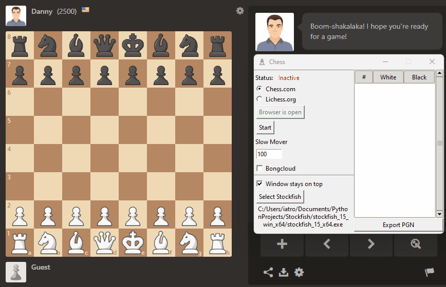
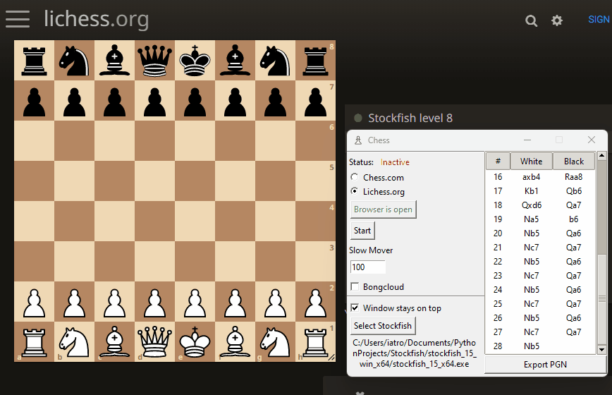

# Chess-X ♟️

> **Automated Stockfish-powered bot for chess.com and lichess.org — with GUI, overlay, and mouse automation.**

Chess-X watches the browser board, queries **Stockfish** for the best move via `python-chess`, and plays it automatically using `PyAutoGUI` / mouseless WebSocket injection. Built for education and local analysis — **not for cheating in rated online games.**

> [!CAUTION]
> **Educational use only.** Using this bot to cheat on chess.com or lichess.org violates their Terms of Service and will result in account bans. The authors do not condone cheating. Use it against bots, in casual analysis, puzzles, or on your own boards only. See [Disclaimer](#-disclaimer).

---

<p align="center">
  
  
  <br/>
  <em>Mouse moves are automated by Python — no human input during bot play</em>
</p>

---

## Table of Contents

- [How It Works](#-how-it-works)
- [Features](#-features)
- [Tech Stack](#-tech-stack)
- [Project Structure](#-project-structure)
- [Installation](#-installation)
- [Usage](#-usage)
- [GUI Reference](#-gui-reference)
- [Stockfish Parameters Explained](#-stockfish-parameters-explained)
- [Keyboard Shortcuts](#-keyboard-shortcuts)
- [Overlay & Evaluation Display](#-overlay--evaluation-display)
- [Troubleshooting](#-troubleshooting)
- [Roadmap](#-roadmap)
- [Contributing](#-contributing)
- [Disclaimer](#-disclaimer)
- [License](#-license)

---

## How It Works

```
┌─────────────┐     ┌──────────────────┐     ┌──────────────┐     ┌─────────────┐     ┌──────────────┐
│  Tkinter    │────>│  ChromeDriver    │────>│   Grabbers   │────>│  python-    │────>│  PyAutoGUI / │
│  GUI        │     │  (Selenium 4.9)  │     │  (DOM scrape)│     │  chess +    │     │  WS Inject   │
│ src/gui.py  │     │  webdriver-mgr   │     │  chesscom /  │     │  Stockfish  │     │  (moveTo /   │
│             │     │                  │     │  lichess     │     │  3.28.0     │     │   dragTo)    │
└─────────────┘     └──────────────────┘     └──────────────┘     └─────────────┘     └──────────────┘
         │                        │                    │                    │                    │
         └────────────────────────┴────────────────────┼────────────────────┘                    │
                                                      ▼                                         ▼
                                            ┌──────────────────┐                      ┌──────────────┐
                                            │  Overlay (PyQt6) │                      │   Browser    │
                                            │  Best-move arrow │                      │   Board      │
                                            │  + Eval bar      │                      │              │
                                            └──────────────────┘                      └──────────────┘
                                                    ▲
                                          Queue / Pipe (multiprocess)
```

1.  **GUI** (`src/gui.py:18`) — Tkinter panel to pick Stockfish binary, site (`chess.com` / `lichess.org`), and engine tuning. Manages two child processes via `multiprocess.Pipe` and `multiprocess.Queue`.
2.  **Browser** (`src/gui.py:536`) — Launches `ChromeDriver` through `selenium` + `webdriver-manager` and navigates to the chosen site. Session URL + ID are passed to the bot process.
3.  **Grabber** (`src/grabbers/chesscom_grabber.py`, `src/grabbers/lichess_grabber.py`) — Site-specific DOM scraping: locates board element (`get_board()`), reads move history (`get_move_list()`), detects color (`is_white()`), and detects game-over. Attaches to the live Selenium session via `src/utilities.py:14` (`attach_to_session`).
4.  **Engine** (`src/stockfish_bot.py:15`, `multiprocess.Process`) — Maintains a `chess.Board`, syncs SAN moves from the grabber, calls `Stockfish.get_best_move()` with configured depth/skill/threads/hash/slow-mover, handles promotion, bongcloud, manual/mouseless modes.
5.  **Actuation** (`src/stockfish_bot.py:75`) — Converts UCI squares to screen pixels (`move_to_screen_pos`) with board-flip compensation, then `pyautogui.moveTo` + `dragTo` (or `lichess.socket.ws.send` for mouseless on Lichess). Respects `mouse_latency`.
6.  **Overlay** (`src/overlay.py:9`, `PyQt6`) — Transparent, click-through, top-most window. Draws best-move arrow via `QPolygon` and a vertical eval bar aligned to the board. Receives data through the shared Queue.

---

## Features

| Category | Feature | chess.com | lichess.org | Notes |
|---|---|---|---|---|
| **Platform** | Windows / Linux | ✅ | ✅ | macOS untested |
| **Opponents** | vs Human (online) | ✅ | ✅ | |
| | vs Bots | ✅ | ✅ | |
| **Puzzles** | Auto-solve + Non-stop | ❌ | ✅ | `Non-stop puzzles` checkbox |
| **Modes** | Manual (hold `3`) | ✅ | ✅ | Shows arrow, waits for key |
| | Mouseless (background) | ❌ | ✅ | WebSocket injection, works minimized |
| | Non-stop online matches | ❌ | ✅ | Auto-clicks `New opponent` |
| | Bongcloud | ✅ | ✅ | Plays `e3/e6/Ke2/Ke7` if legal |
| **Tuning** | Mouse latency 0–15s | ✅ | ✅ | Slider `0.2s` steps |
| | Skill 0–20 | ✅ | ✅ | Stockfish `Skill Level` |
| | Depth 1–20 | ✅ | ✅ | Search depth |
| | Memory (Hash) MB | ✅ | ✅ | Default `512` |
| | Threads | ✅ | ✅ | Default `1` |
| | Slow Mover 10–1000 | ✅ | ✅ | Default `100` |
| **Analytics** | PGN export | ✅ | ✅ | Via `Export PGN` button |
| | Live eval (cp / mate) | ✅ | ✅ | In GUI + overlay bar |
| | W/D/L % | ✅ | ✅ | From `get_wdl_stats()` |
| | Material count | ✅ | ✅ | `+3` / `-2` / `0` |
| | Accuracy tracking | ✅ | ✅ | Bot vs Opponent % |
| **UI** | Eval bar overlay | ✅ | ✅ | Sigmoid-scaled, board-aligned |
| | Best-move arrow | ✅ | ✅ | Red translucent polygon |
| | Move list Treeview | ✅ | ✅ | Auto-scroll |
| | Window always-on-top | ✅ | ✅ | Toggleable |

> Full GUI control reference: see [GUI Reference](#-gui-reference).

---

## 🛠 Tech Stack

| Layer | Library | Version | Purpose |
|---|---|---|---|
| Automation | `selenium` | `4.9.1` | ChromeDriver control |
| | `webdriver-manager` | `4.0.1` | Driver auto-download |
| | `PyAutoGUI` | `0.9.53` | Mouse `moveTo`/`dragTo`/`click` |
| | `keyboard` | `0.13.5` | Global hotkeys `1`/`2`/`3` |
| Engine | `stockfish` | `3.28.0` | Python wrapper for Stockfish UCI |
| | `chess` | `1.10.0` | `python-chess` board & SAN/UCI |
| IPC | `multiprocess` | `0.70.14` | `Process` + `Pipe` + `Queue` |
| UI | `PyQt6` | `6.9.0` | Transparent overlay |
| | `tkinter` | stdlib | Main control GUI (`ttk` clam) |
| Util | `packaging` | `24.0` | Dependency helper |

**Python:** 3.10+ recommended (tested with 3.10–3.12). Stockfish binary must be downloaded separately from [stockfishchess.org](https://stockfishchess.org/).

---

## Project Structure

```
chess-X/
├── src/
│   ├── gui.py                      # Tkinter GUI, process lifecycle, IPC (825 LOC)
│   ├── stockfish_bot.py            # Core bot loop, move execution, eval pipeline (483 LOC)
│   ├── overlay.py                  # PyQt6 transparent overlay — arrow + eval bar (298 LOC)
│   ├── utilities.py                # attach_to_session, char_to_num helpers
│   ├── grabbers/
│   │   ├── grabber.py              # Abstract Grabber — board/moves/color/game-over contract
│   │   ├── chesscom_grabber.py     # chess.com DOM selectors (board-play-computer / board-single)
│   │   └── lichess_grabber.py      # lichess DOM + WebSocket mouseless + puzzle detection
│   └── assets/
│       └── pawn_32x32.png          # Window icon
├── requirements.txt
├── run.bat                         # venv\Scripts\python.exe src\gui.py
├── match_chesscom.gif
├── match_lichess.gif
├── TODO.md                         # Roadmap & improvement backlog
├── LICENSE                         # MIT
└── README.md
```

---

## 📦 Installation

### Prerequisites

- **Google Chrome** installed (Chromium also works but untested).
- **Python 3.10+** and `pip`.
- **Stockfish engine** binary — download from <https://stockfishchess.org/download/>.
  - On **Linux**, add execute permission: `chmod +x stockfish`.
  - On **Windows**, the binary is typically `stockfish-windows-x86-64-avx2.exe`.

### Steps

```bash
# 1. Clone (or download ZIP)
git clone https://github.com/ifaz2611/chess-X.git
cd chess-X   

# 2. Create virtual environment
# Windows:
python -m venv venv
# Linux / macOS:
python3 -m venv venv

# 3. Install dependencies
# Windows:
venv\Scripts\pip.exe install -r requirements.txt
# Linux / macOS:
venv/bin/pip install -r requirements.txt

# 4. Launch
# Windows:
venv\Scripts\python.exe src\gui.py
# Linux / macOS:
venv/bin/python3 src/gui.py
# Or on Windows double-click:
run.bat
```

> If `PyAutoGUI` fails on Linux Wayland, switch to X11/Xorg or set `QT_QPA_PLATFORM=xcb`.

---

## Usage

1.  Run `src/gui.py` — the control panel appears (always on top by default).
2.  Click **Select Stockfish** → navigate to the Stockfish executable you downloaded.
3.  Choose **Chess.com** or **Lichess.org** via radio buttons.
4.  (Optional) Tune Stockfish params, latency, and modes (see below).
5.  Click **Open Browser** — ChromeDriver opens to the selected site. Log in if needed.
6.  Navigate to a live game (Play → Quick pairing / vs Computer) or a Lichess puzzle.
7.  Click **Start** (or press `1`). Status turns green: `Running`.
8.  Watch the overlay arrow and eval bar. The bot plays automatically.
9.  Press **Stop** (or `2`) to pause at any time. Re-press `Start`/`1` to resume.

**PGN Export:** After/during a game, click **Export PGN** → save `match.pgn` (SAN notation).

---

## GUI Reference

| Control | Type | Default | Description |
|---|---|---|---|
| `Status` | label | `Inactive` (red) | `Running` (green) when bot loop active |
| `Eval / WDL / Material / Bot Acc / Opponent Acc` | labels | `-` | Live from `send_eval_data()` — updated each half-move |
| `Chess.com / Lichess.org` | radio | `chesscom` | Target site; determines grabber class |
| `Open Browser` | button | — | Spawns ChromeDriver; disables after open |
| `Start / Stop` | button | `Start` | Spawns/kills `StockfishBot` + overlay processes |
| `Manual Mode` | checkbox | off | When checked, bot shows arrow and waits for `hold 3` to execute |
| `Mouseless Mode` | checkbox | off | Lichess only — plays via `lichess.socket.ws.send` without moving cursor |
| `Non-stop puzzles` | checkbox | off | Lichess only — auto `Continue training` on checkmate |
| `Non-stop online matches` | checkbox | off | Lichess only — auto `New opponent` on game-over |
| `Bongcloud` | checkbox | off | Forces `e3/e6/Ke2/Ke7` line if legal |
| `Mouse Latency` | scale 0–15s | `0.0` | `time.sleep` before `dragTo` |
| `Slow Mover` | entry 10–1000 | `100` | Stockfish `Slow Mover` UCI — higher = longer think |
| `Skill Level` | scale 0–20 | `20` | Stockfish skill |
| `Depth` | scale 1–20 | `15` | Search depth (`stockfish depth=`) |
| `Memory` | entry MB | `512` | Stockfish `Hash` |
| `CPU Threads` | entry | `1` | Stockfish `Threads` |
| `Window stays on top` | checkbox | on | `master.attributes("-topmost", ...)` |
| `Select Stockfish` | button | — | File picker for engine path |
| Move Treeview | table `# / White / Black` | — | Auto-scrolled SAN history |
| `Export PGN` | button | — | Writes `1. e4 c5 2. Nf3 ...` to chosen file |

---

## Stockfish Parameters Explained

| Param | UCI Name | Range | Effect |
|---|---|---|---|
| **Skill Level** | `Skill Level` | 0–20 | Artificially weakens play. `20` = full strength. Lower values add intentional blunders. |
| **Depth** | `depth` | 1–20 | Plies to search. Higher = stronger but slower. `15` is a good balance. `20` can stall on slow CPUs. |
| **Memory** | `Hash` | MB | TT size. More hash helps deeper search. `512`–`1024` is typical for desktop. |
| **Threads** | `Threads` | 1–N cores | Parallel search. `1` safest; set to physical cores for max NPS. |
| **Slow Mover** | `Slow Mover` | 10–1000 | Time-management bias. `10` = rush, `100` = default, `500+` = quality over speed. Useful for bullet vs classical. |

> Tip: For human-like play, try `Skill 8–12 + Depth 10–12 + Slow Mover 80`. For analysis, use `Skill 20 + Depth 18–20 + Threads = cores`.

---

## Keyboard Shortcuts

| Key | Action | Condition |
|---|---|---|
| `1` | **Start** bot | Browser must be open (`keyboard.is_pressed` poll in `gui.py:507`) |
| `2` | **Stop** bot | Anytime |
| `3` | **Execute** next move | Only when `Manual Mode` is enabled (hold or tap) |

> On Linux, `keyboard` may require `sudo` or `input` group membership: `sudo usermod -aG input $USER` then re-login. On some distros, `pip install keyboard` + `sudo` is needed for global hooks.

---

## Overlay & Evaluation Display

- **Arrow** — Red translucent `QPolygon` from source square center to target square center. Computed in `overlay.py:244` (`get_arrow_polygon`). Visible in manual mode and during think.
- **Eval Bar** — Vertical bar left of the board (`overlay.py:147`):
  - Height = board height, width `40px`, margin `15px`.
  - Sigmoid mapping for `cp`: `advantage = 1 / (1 + exp(-value*0.5))`, clamped `±10`.
  - Mate: `1.0` (winning) / `0.0` (losing) — full/empty bar.
  - Colors flip based on `is_white` so bottom always represents *your* side.
  - Text shows `+1.23` / `M3` / `M-2`.
- **GUI labels** — `Eval` (cp or `M`), `WDL` (`win/draw/loss %`), `Material` (`+3`), `Bot Acc` / `Opponent Acc` (SAN-match % against `get_best_move_time(300)`).

---

## Troubleshooting

| Symptom | Cause / Fix |
|---|---|
| `Can't find Chrome` dialog | Install Google Chrome. ChromeDriver version is auto-managed by `webdriver-manager`. |
| `Stockfish path is not valid / not executable` | Re-select binary. On Linux run `chmod +x stockfish` and verify `file stockfish` shows ELF. |
| `Can't find board / player color / moves list` | Site DOM changed (XPath brittle) or wrong page. Ensure you are on a live game/puzzle, not the homepage. Update selectors in `chesscom_grabber.py` / `lichess_grabber.py`. |
| `Game has already finished` | Bot started on a completed game. Start a new pairing. |
| Overlay not showing / behind windows | Check PyQt6 install, X11 vs Wayland, and that the Queue thread is alive. Try `QT_QPA_PLATFORM=xcb`. |
| `keyboard` hotkeys not working (Linux) | Run with `sudo venv/bin/python src/gui.py` or add user to `input` group. |
| PyAutoGUI clicks miss squares | DPI scaling / multi-monitor offset. `get_top_left_corner()` uses `window.screenX/Y`; verify board `location`/`size` in devtools. Try 100% display scaling. |
| `data-processed` stale after new game | Known limitation — `moves_list` reset logic may miss rematches. Click **Stop → Start** to force `RESET` + `START`. |
| Chrome closes immediately | Another Chrome instance or driver mismatch. Close all Chrome, delete `~/.wdm`, retry. Check `chrome.get_log("driver")` in `gui.py:398`. |
| High CPU / slow moves | Lower `Depth` / `Threads` / `Hash`, or reduce `Slow Mover`. Monitor with `htop`. |

---

## Roadmap

See **[TODO.md](TODO.md)** for the full prioritized backlog (humanization, cross-site parity, GUI modernization, testing, CI, and more).

Highlights:

- Human-like delays & misclicks, configurable play strength profiles
- Chess.com mouseless / puzzle / non-stop parity with Lichess
- Robust selectors + auto-recovery on DOM changes
- Config persistence, headless mode, Docker, and packaged executable
- Unit/integration tests, linting, and pre-commit hooks

Contributions welcome — pick an item from `TODO.md`, open an issue, and submit a PR!

---

## Contributing

1. Fork → create feature branch (`git checkout -b feat/human-delays`).
2. Follow existing style (no mandatory formatter yet — see `TODO.md` for planned `ruff`/`black`).
3. Test on both sites if touching grabbers.
4. Update `README.md` / `TODO.md` if adding features.
5. Open PR with screenshots/GIFs for UI changes.

---

## Disclaimer

This project is for **educational and research purposes only**. The authors do not encourage or support cheating. Using automation to gain an unfair advantage in online chess violates the rules of chess.com (`Fair Play Policy`) and lichess.org (`Terms of Service`) and will lead to account termination and rating bans.

- Use this bot only against **computer opponents**, in **casual/unrated analysis**, on **puzzles**, or on **your own private boards**.
- If you publish analysis generated with this tool, disclose the engine assistance.
- The maintainers assume no liability for misuse.

---

## License

**MIT** — Copyright (c) 2022 Panagiotis Iatrou. See [LICENSE](LICENSE).

---

<p align="center"><em>Star ⭐ the repo if you found it useful — and please play fair!</em></p>
