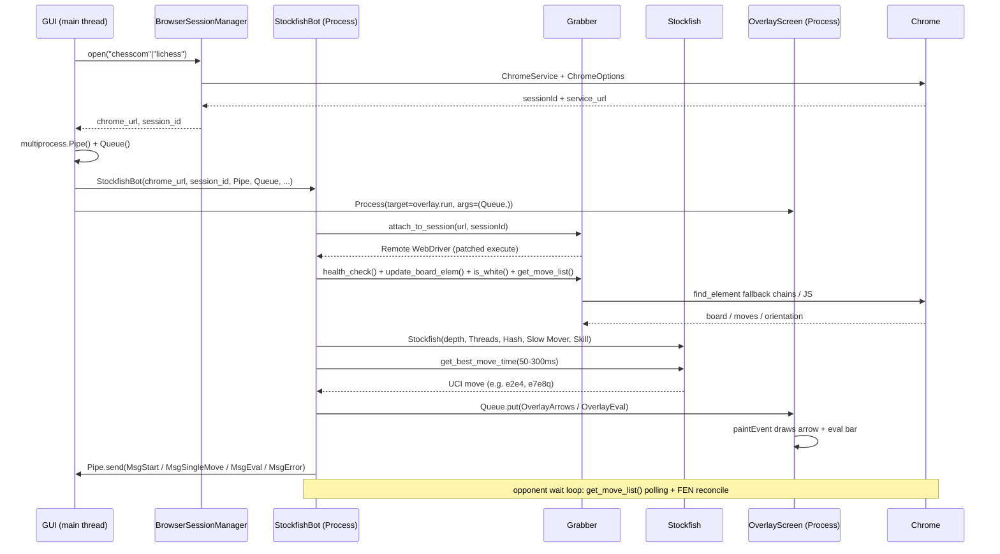
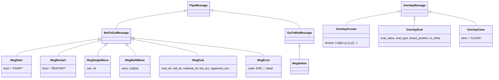
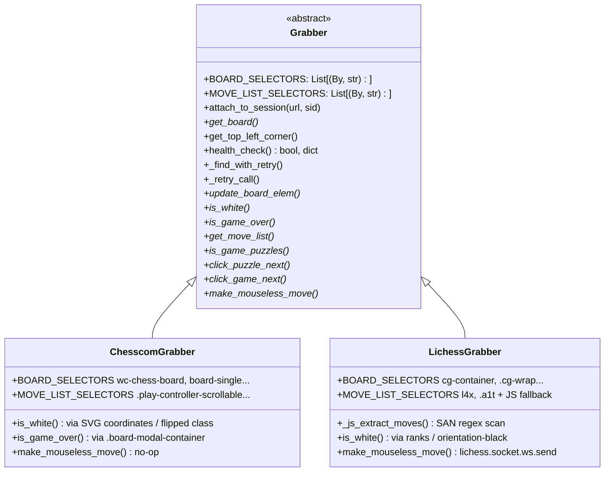
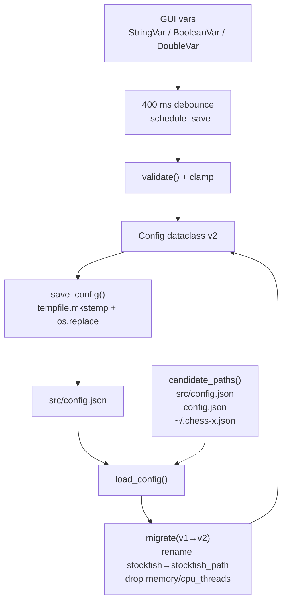

# Architecture — Chess-X

> **Source version:** `pyproject.toml:3` — `2.1.0` · Python 3.10–3.12 · Stockfish (unbundled) + Selenium 4.49 + PyQt6 + python-chess

---

## 1. High-Level Pipeline

```mermaid
flowchart LR
    subgraph UI[Control Plane — Tkinter]
        GUI["gui.py\nTkinter GUI"]:::gui
        CFG["config_store.py\nConfig v2"]:::store
        HOT["hotkeys.py\nHotkeyManager"]:::util
        BSM["browser_session.py\nBrowserSessionManager"]:::browser
    end
    subgraph BR[Browser]
        CHR["ChromeDriver\nSelenium + webdriver-manager"]:::browser
        DOM["Live Board DOM\nchess.com / lichess.org"]:::dom
    end
    subgraph GRAB[Grabbers]
        ABS["grabber.py\nGrabber ABC + health_check"]:::grabber
        CC["chesscom_grabber.py"]:::grabber
        LI["lichess_grabber.py\n+ JS obfuscation fallback"]:::grabber
    end
    subgraph CORE[Bot Process — multiprocess]
        BOT["stockfish_bot.py\nStockfishBot (Process)"]:::bot
        BS["board_sync.py\nBoardSync"]:::svc
        ES["engine_service.py\nEngineService"]:::svc
        ME["move_executor.py\nMoveExecutor"]:::svc
        GL["game_loop.py\nGameLoopState"]:::svc
    end
    subgraph ENG[Engine]
        SF["Stockfish binary\nvia python stockfish wrapper"]:::engine
        CB["python-chess\nchess.Board"]:::engine
    end
    subgraph ACT[Act]
        PA["PyAutoGUI\nmoveTo/dragTo"]:::act
        WS["lichess.socket.ws.send\nmouseless inject"]:::act
    end
    subgraph OVL[Overlay]
        OQ["Overlay PyQt6\nOverlayScreen"]:::overlay
        EQ["eval_bar + arrow\nQPolygon + sigmoid bar"]:::overlay
    end

    GUI --> BSM --> CHR --> DOM --> ABS
    ABS --> CC & LI --> BOT
    BOT --> BS & ES & ME & GL
    BS <--> CB
    ES <--> SF
    BOT -->|get_best_move_time| SF
    ME --> PA & WS
    PA --> DOM
    WS --> DOM
    BOT -. "Pipe: protocol.py Msg* / Queue: Overlay* "...-> GUI
    BOT -. "Queue OverlayArrows/OverlayEval"...-> OQ
    OQ --> EQ -. draws on .-> DOM
    CFG -. "atomic JSON + migration"...-> GUI
    HOT -. "1/2/3 Esc" .-> GUI

    classDef gui fill:#E6F2EC,stroke:#2E7D5B
    classDef browser fill:#E8F0FF,stroke:#3F7180
    classDef grabber fill:#FFF2E0,stroke:#B7832F
    classDef bot fill:#F3E8FF,stroke:#6B7280
    classDef svc fill:#FDF2F8,stroke:#9D174D
    classDef engine fill:#E0F2FE,stroke:#075985
    classDef act fill:#FEF3C7,stroke:#92400E
    classDef overlay fill:#FFE4E6,stroke:#9F1239
    classDef store fill:#ECFDF5,stroke:#047857
    classDef util fill:#F1F5F9,stroke:#334155
    classDef dom fill:#FFF7ED,stroke:#7C2D12
```



### Stage table (mirrors `README.md:118`)

| # | Stage | Primary module | What happens | Key calls |
|---|-------|----------------|--------------|-----------|
| 1 | **Control** | `src/gui.py:57` | Pick Stockfish path, site, tuning. Spawns two child processes over `multiprocess.Pipe` + `Queue`. | `GUI.on_start_button_listener:1201`, `BrowserSessionManager.open` |
| 2 | **Browser** | `src/gui.py:1023` + `src/browser_session.py` | Launches ChromeDriver via `webdriver-manager` fallback to Selenium Manager. Handles `--no-sandbox` on Linux, `atexit` cleanup. | `ChromeDriverManager().install()`, `webdriver.Chrome` |
| 3 | **Grab** | `src/grabbers/*` | Site-specific DOM scraping: `get_board()`, `get_move_list()`, `is_white()`, `is_game_over()`. Attaches via `attach_to_session` (`src/utilities.py:245`). | `Grabber.health_check:92`, `ChesscomGrabber.BOARD_SELECTORS`, `LichessGrabber._js_extract_moves:152` |
| 4 | **Think** | `src/stockfish_bot.py:453` + `src/engine_service.py` | Syncs SAN → `chess.Board`, `stockfish.set_position`, `get_best_move_time(ms)` depth/skill/threads/hash. CP-loss accuracy, WDL, material. | `Stockfish.get_best_move_time`, `EngineService.record_cp_loss` |
| 5 | **Act** | `src/move_executor.py` + `src/stockfish_bot.py:348` | UCI squares → screen pixels with flip compensation (`char_to_num`), `pyautogui.dragTo` or `lichess.socket.ws.send`. Promotion click fix for all 4 pieces. | `MoveExecutor.move_to_screen_pos` |
| 6 | **Render** | `src/overlay.py:16` | Transparent click-through `QWidget`. Red `QPolygon` arrow + sigmoid eval bar. | `OverlayScreen.paintEvent:157`, `draw_eval_bar:173` |

---

## 2. Process Model



**Why `multiprocess` not `multiprocessing`?** `multiprocess` (`0.70.14`) pickles lambdas/closures better than stdlib `multiprocessing` and is required because `StockfishBot` subclasses `multiprocess.Process`. The `Pipe` is used for reliable GUI↔bot control messages, the `Queue` for overlay (fire-and-forget drawing — draining on new game via `OverlayClear`).

**Attach hack:** `utilities.attach_to_session:245` monkey-patches `WebDriver.execute` to intercept `newSession` and inject the existing `session_id`, so the bot process re-uses the GUI's Chrome session without spawning a second browser. See `grabber.py:26`.

---

## 3. Module Map

```
src/
├── gui.py                 # Tkinter orchestrator (~2058 LOC) — builds header/body/footer,
│                          #  config persistence (400 ms debounce via config_store),
│                          #  validation traces, browser/monitor threads, Pipe/Queue owner
├── stockfish_bot.py       # Facade Process — delegates to BoardSync / EngineService /
│                          #  MoveExecutor / GameLoopState; handles mate, promotion,
│                          #  takeback, new-game FEN reconcile, P1 accuracy model
├── overlay.py             # PyQt6 transparent window — QPolygon arrow (overlay.py:270),
│                          #  sigmoid eval bar (cp→0.5 logistic, mate→0/1), board-aligned
├── config_store.py        # Config v2 dataclass — validate/migrate, atomic tmp+rename save,
│                          #  candidate_paths [src/config.json, config.json, ~/.chess-x.json]
├── protocol.py            # Typed dataclasses: MsgStart/Restart/SingleMove/MultiMove/Eval/Error
│                          #  + OverlayArrows/Eval/Clear; legacy string converters
├── browser_session.py     # ChromeDriver lifecycle — webdriver-manager + Selenium Manager fallback,
│                          #  WDM path fix for chromedriver.exe, atexit + signal cleanup
├── hotkeys.py             # HotkeyManager — keyboard → pynput fallback, input-group check
├── board_sync.py          # DOM ↔ chess.Board: reconcile_board_fen, takeback/abort handling
├── engine_service.py      # Stockfish settings, eval_to_white_cp, cp_loss→bucket, accuracy math,
│                          #  WDL + material
├── move_executor.py       # UCI → screen pixels — flip compensation, char_to_num, promotion clicks
├── game_loop.py           # Loop state helpers (non-stop puzzles/matches, restart handshake)
├── utilities.py           # get_logger (RotatingFileHandler 5 MB×3), retry_on_stale, wait_for_any_element,
│                          #  find_element_with_fallback, attach_to_session, Wayland/input checks
├── grabbers/
│   ├── grabber.py         # Abstract Grabber + BOARD/MOVE selectors + health_check + _clear_overlay_queue
│   ├── chesscom_grabber.py# wc-chess-board / board-single selectors, SVG rank check, modal game-over
│   └── lichess_grabber.py # cg-container, JS SAN extraction for obfuscated builds (rm6/l4x/i5d/aPp),
│                          #  .a1t active-class, puzzle vs normal list, mouseless ws.send
├── analysis.py / puzzle_trainer.py / local_board.py  # offline helpers
├── controls.py / eval_panel.py                        # GUI control row helpers
└── assets/pawn_32x32.png
tests/
├── fixtures/chesscom.html, lichess.html               # offline snapshots for CI
├── test_board_sync.py  test_config.py  test_grabbers.py  test_utilities.py
.github/workflows/ci.yml   # Windows+Linux × 3.10–3.12, pytest-cov, ruff, mypy
```

---

## 4. IPC — `src/protocol.py:1`



- **Legacy strings still accepted:** `legacy_to_bot_msg:112` parses `S_MOVEe4`, `M_MOVEe4,c5`, `EVAL|...`, `ERR_BOARD` into typed dataclasses, so GUI `_handle_pipe_message:838` handles both.
- **Error codes:** `ERR_PERM | ERR_EXE | ERR_BOARD | ERR_COLOR | ERR_MOVES | ERR_GAMEOVER | ERR_TIMEOUT | ERR_DISCONNECT | ERR_STALE | ERR_ENGINE` — centralised in `protocol.MsgError` and `stockfish_bot.py:878`.

---

## 5. Grabber Hierarchy



See the authoring guide for selector strategy: `docs/GRABBER_GUIDE.md`.

---

## 6. Configuration — `src/config_store.py:1`



Key invariants: `CONFIG_VERSION = 2` (`config_store.py:37`), `Hash/Threads` are **auto-managed** (512 MB + `os.cpu_count()//2`) and never stored — `stockfish_bot.py:50`. `slow_mover 10–1000`, `skill 0–20`, `depth 1–20` clamped in `validate:150`.

---

## 7. Overlay Rendering — `src/overlay.py:157`

- **Arrow:** `get_arrow_polygon:270` — normalises `start→end` vector, builds arrowhead (height `25px`, shaft `arrow_height/5`), returns `QPolygon` of 7 points. Drawn semi-transparent red `QColor(255,0,0,122)`.
- **Eval bar:** vertical strip `40×board.height`, margin `15px` left of board (`update_eval_bar_position:105`). Centipawns sigmoid `1/(1+exp(-value*0.5))` clamped `±10` (`draw_eval_bar:193`). Mate → full/empty bar. Colours flip with `is_white`. Centre line + `+1.23` / `M3` label at bottom.

---

## 8. Resilience Patterns

| Pattern | Where | Notes |
|---------|-------|-------|
| Fallback selector chains | `ChesscomGrabber.BOARD_SELECTORS`, `LichessGrabber.BOARD_SELECTORS` | CSS → XPath, most likely first; last resort tagged as brittle in `health_check:125` warning |
| JS SAN extraction | `LichessGrabber._js_extract_moves:152` | Scans `.a1t` parent, then `rm6/l4x/aPp/i5d`, then most-SAN-children scan — survives obfuscated tag renames per deploy |
| Stale retry | `utilities.retry_on_stale:154`, `Grabber._retry_call:67` | Exponential backoff `0.06·2ⁿ` on `StaleElementReferenceException` |
| FEN reconcile | `BoardSync.reconcile_board_fen`, `stockfish_bot._reconcile_board_fen:157` | Detects takeback (move count ↓), abort, mid-game DOM replacement; rebuilds `chess.Board` from SAN |
| Board-empty as `[]` not `None` | `chesscom_grabber.get_move_list:252`, `lichess_grabber.get_move_list:314` | Avoids spurious `ERR_MOVES` on fresh board |
| Health check | `Grabber.health_check:92` | Called on bot startup; logs which selector matched, warns if only fallback did |
| Logging | `utilities.get_logger:20` | `RotatingFileHandler` 5 MB×3 → `logs/chess-x.log`, `CHES_X_VERBOSE=1` for DEBUG |

---

## 9. Related Docs

- Grabber authoring: `docs/GRABBER_GUIDE.md`
- Troubleshooting: `docs/TROUBLESHOOTING.md`
- Changelog: `CHANGELOG.md`
- Quick start: `GETSTART.md` · Contributing: `CONTRIBUTING.md`


By ifaz Md Zahin    
