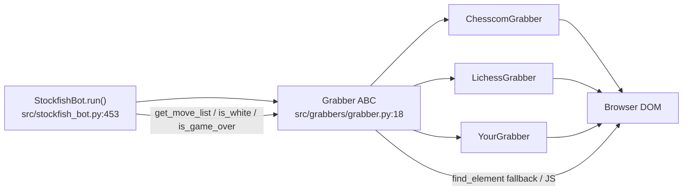

# Grabber Authoring Guide — How to Add a New Site

> **Target reader:** contributor adding `NewSiteGrabber` (e.g., `chess24`, `lichess variant`, `chess.com analysis`).  
> **Prerequisite:** read `docs/ARCHITECTURE.md` §5 and `src/grabbers/grabber.py:18`.

---

## 1. What a Grabber Does

A `Grabber` is the site-specific DOM adapter between the browser board and the engine loop. The bot process calls it on every tick via the same 8-method contract — site differences (selectors, board orientation, move-list encoding) stay **inside the grabber**.



Runtime lifecycle (see `stockfish_bot.py:453`):

1. `Grabber(attach_to_session(...))` — re-uses GUI's Chrome session.
2. `health_check()` — verifies board + move selectors before loop.
3. Loop: `update_board_elem()` → `is_white()` → `get_move_list()` → `get_top_left_corner()` (for pixel mapping) → optional `make_mouseless_move()` / `click_puzzle_next()`.

---

## 2. The Contract — `Grabber` ABC

File: `src/grabbers/grabber.py:18`

| Member | Kind | Required | What to implement |
|--------|------|----------|-------------------|
| `BOARD_SELECTORS` | `List[(By, str)]` | yes | Ordered fallback chain to locate the board container. CSS first, XPath last. |
| `MOVE_LIST_SELECTORS` | `List[(By, str)]` | yes | Ordered chain to locate the move-history container (may be empty on fresh board). |
| `__init__(chrome_url, chrome_session_id)` |  | inherit | Calls `attach_to_session` (`utilities.py:245`). Rarely override. |
| `get_board()` | concrete | — | Returns `self._board_elem`. |
| `get_top_left_corner()` | concrete | — | JS `window.screenX/Y + outer/inner delta` with 2-attempt retry. Override only if site uses iframe offset. |
| `health_check()` | concrete | — | Uses `_find_with_retry`. Logs which selector matched, warns if only last-resort fallback did. Call it before loop — `stockfish_bot.py:462`. |
| `update_board_elem()` | abstract | **yes** | Find board via `self._find_with_retry(self.BOARD_SELECTORS)` and assign `self._board_elem`. 2–3 retries on stale. |
| `is_white()` | abstract | **yes** | Return `True`/`False`/`None`. White at bottom? `None` on transient failure → bot retries. |
| `is_game_over()` | abstract | **yes** | Return `bool`. Can check modal, result banner, URL, or absence of board. |
| `get_move_list()` | abstract | **yes** | Return `List[str]` of SAN (e.g. `["e4","c5","Nf3"]`), `[]` if 0 moves (fresh game), `None` only if genuinely unable to locate container. Must handle stale, empty-game, and takeback (length ↓). |
| `is_game_puzzles()` | abstract | **yes** | Return `bool`. `False` if site has no puzzles mode (like `ChesscomGrabber:340`). |
| `click_puzzle_next()` | abstract | **yes** | Click next-puzzle button. No-op if unsupported. |
| `click_game_next()` | abstract | **yes** | Click rematch / new-opponent. Multiple selector fallbacks. |
| `make_mouseless_move(move, move_count)` | abstract | **yes** | WebSocket / API injection for background play. No-op if unsupported. |

Helpers you get for free:

- `_find_with_retry(selectors, timeout=2)` → `utilities.find_element_with_fallback` (`grabber.py:59`)
- `_wait_for_any(selectors, timeout=6)` → `utilities.wait_for_any_element` (`grabber.py:64`)
- `_retry_call(func, ...)` — exponential backoff on stale (`grabber.py:67`)
- `_clear_overlay_queue(overlay_queue)` — drain stale arrows (`grabber.py:143`)

---

## 3. Step-by-Step — Add `ExampleGrabber`

Let's add a fictional site `examplechess.com`.

### Step 0 — Discover the DOM

1. Open `https://examplechess.com` in Chrome, start a game vs Computer.
2. DevTools (F12) → Elements → inspect board. Note stable attributes.
3. Record at least two board containers (current + legacy) and the move list.

```js
// In DevTools console, quick sanity:
document.querySelector('div.example-board')       // board?
document.querySelector('.example-move-list')   // moves?
document.querySelectorAll('.example-move-list [data-ply]')
```

Screenshoot the relevant nodes — you'll need them for the PR.

### Step 1 — Create `src/grabbers/example_grabber.py`

```python
import time
from selenium.common import NoSuchElementException, StaleElementReferenceException, WebDriverException
from selenium.webdriver.common.by import By

from grabbers.grabber import Grabber
from utilities import get_logger

logger = get_logger("grabber.example")

class ExampleGrabber(Grabber):
    # Order: most stable + fastest first. Last entry is brittle but better than crashing.
    BOARD_SELECTORS = [
        (By.CSS_SELECTOR, "div.example-board"),
        (By.ID, "board"),
        (By.CSS_SELECTOR, ".board"),
        (By.XPATH, "//div[contains(@class,'example-board')]"),
    ]

    MOVE_LIST_SELECTORS = [
        (By.CSS_SELECTOR, ".example-move-list"),
        (By.CSS_SELECTOR, "div.moves"),
        (By.CSS_SELECTOR, "[data-test='move-list']"),
        (By.XPATH, "//div[contains(@class,'move-list')]"),
    ]

    def update_board_elem(self):
        for attempt in range(2):
            try:
                elem = self._find_with_retry(self.BOARD_SELECTORS, timeout=2)
                self._board_elem = elem
                if elem is None:
                    logger.warning("update_board_elem: no board (attempt %d)", attempt + 1)
                return
            except (StaleElementReferenceException, WebDriverException) as e:
                logger.debug("update_board_elem stale %d: %s", attempt, e)
                time.sleep(0.08 * (2 ** attempt))
        self._board_elem = None

    def is_white(self):
        # Strategy: look for orientation class, else coordinates element, else fallback
        for attempt in range(3):
            try:
                # Try orientation class on board/wrap
                for by, val in self.BOARD_SELECTORS:
                    try:
                        b = self.chrome.find_element(by, val)
                        cls = (b.get_attribute("class") or "") + " " + (b.get_attribute("orientation") or "")
                        low = cls.lower()
                        if "flipped" in low or "black" in low:
                            return False
                    except Exception:
                        continue
                # Fallback: coordinates SVG text "1" at bottom-left
                try:
                    coords = self.chrome.find_element(By.CSS_SELECTOR, ".coordinates")
                    squares = coords.find_elements(By.XPATH, ".//*")
                    # pick min-x max-y as ChesscomGrabber does
                    # ... (copy pattern from chesscom_grabber.py:129)
                    for el in squares:
                        if el.text.strip() == "1":
                            return True
                    return False
                except NoSuchElementException:
                    pass
                return None
            except StaleElementReferenceException:
                time.sleep(0.06 * (2 ** attempt))
        return None

    def is_game_over(self):
        for attempt in range(2):
            try:
                try:
                    modal = self.chrome.find_element(By.CSS_SELECTOR, ".game-over-modal, .result-banner")
                    return modal.is_displayed()
                except NoSuchElementException:
                    return False
            except StaleElementReferenceException:
                time.sleep(0.05)
        return False

    def get_move_list(self):
        for attempt in range(3):
            try:
                container = None
                for by, val in self.MOVE_LIST_SELECTORS:
                    try:
                        container = self.chrome.find_element(by, val)
                        if container:
                            break
                    except NoSuchElementException:
                        continue
                if container is None:
                    if not self.moves_list:
                        return []        # fresh game — not an error
                    if self.get_board() is not None:
                        return list(self.moves_list.values())
                    return None

                nodes = container.find_elements(By.CSS_SELECTOR, "[data-ply]")
                if len(nodes) == 0 and self.moves_list:
                    logger.info("new game detected — resetting")
                    self.reset_moves_list()

                # incremental: only unprocessed nodes
                q = "[data-ply]:not([data-processed])" if self.moves_list else "[data-ply]"
                moves = container.find_elements(By.CSS_SELECTOR, q)
                for m in moves:
                    try:
                        text = m.text.strip()
                        ply = m.get_attribute("data-ply")
                    except StaleElementReferenceException:
                        continue
                    if not ply or not text:
                        continue
                    # text may contain piece symbols — strip to SAN
                    self.moves_list[ply] = text
                    try:
                        self.chrome.execute_script("arguments[0].setAttribute('data-processed','true')", m)
                    except (StaleElementReferenceException, WebDriverException):
                        pass
                return list(self.moves_list.values())
            except (StaleElementReferenceException, WebDriverException) as e:
                logger.debug("get_move_list retry %d: %s", attempt, e)
                time.sleep(0.06 * (2 ** attempt))
        return list(self.moves_list.values()) if self.moves_list else None

    def is_game_puzzles(self):
        # Example site has no puzzle mode
        return False

    def click_puzzle_next(self):
        pass

    def click_game_next(self):
        selectors = [
            (By.CSS_SELECTOR, "button.new-game"),
            (By.XPATH, "//button[contains(., 'Rematch')]"),
            (By.XPATH, "//button[contains(., 'New Game')]"),
        ]
        for by, val in selectors:
            try:
                btn = self.chrome.find_element(by, val)
                if btn and btn.is_displayed():
                    self.chrome.execute_script("arguments[0].click();", btn)
                    logger.info("Clicked next game %s=%s", by, val)
                    return
            except (NoSuchElementException, StaleElementReferenceException, WebDriverException):
                continue

    def make_mouseless_move(self, move, move_count):
        # Not supported — leave as no-op or implement WS if docs exist
        pass
```

Key patterns copied from reference implementations:

- **Chesscom** (`src/grabbers/chesscom_grabber.py:14`) — `wc-chess-board` + SVG coordinate fallback + `data-figurine`.
- **Lichess** (`src/grabbers/lichess_grabber.py:152`) — JS extraction for obfuscated tags; read that method before adding mouseless.

> **SAN requirement:** `get_move_list()` must return SAN strings parseable by `chess.Board.push_san` (`stockfish_bot.py:539`). Strip move numbers, unicode pieces, and result markers (`1-0`).

### Step 2 — Wire the GUI

`src/gui.py` restricts `website` to `chesscom|lichess` (`config_store.py:136`). Add a third option:

1. In `gui.py:_build_controls:255` add a radio value `"example"` and handle it in `_update_platform_radios`.
2. Validate in `config_store.validate:136` (allow `"example"`).
3. In `StockfishBot.run:454` add:

```python
if self.website == "chesscom":
    self.grabber = ChesscomGrabber(...)
elif self.website == "lichess":
    self.grabber = LichessGrabber(...)
elif self.website == "example":
    from grabbers.example_grabber import ExampleGrabber
    self.grabber = ExampleGrabber(...)
```

Keep `enable_mouseless_mode` guard — if your site supports it, remove the `chesscom` check in `gui.py:1289`.

### Step 3 — Selectors: Rules of Thumb

| Rule | Why | Example |
|------|-----|---------|
| Prefer `CSS_SELECTOR` over `XPath` | Faster, less flaky | `div.example-board` before `//div[contains(@class,'example-board')]` |
| Most stable first | Early break avoids slow XPath | ID → stable class → attribute → XPath |
| Include at least one broad fallback | Last resort before `None` | `div[class*='board']` |
| Use `data-*` when available | Survives CSS renames | `div[data-ply]`, `wc-chess-board` |
| Never hardcode full XPath from DevTools | Brittle on layout change | `/html/body/div[2]/main/div[1]/div/cg-container` is last resort only |
| For obfuscated builds | Add JS extraction fallback (see Lichess) | Scan `.a1t` → children SAN regex |

### Step 4 — Tests

Create `tests/test_grabber_example.py` (mirrors `tests/test_grabbers.py:1`):

```python
import os, sys
sys.path.insert(0, os.path.join(os.path.dirname(__file__), "..", "src"))
from unittest.mock import MagicMock, patch
from selenium.common import NoSuchElementException

def test_example_board_fallback_returns_empty_not_none():
    from grabbers.example_grabber import ExampleGrabber
    with patch("grabbers.grabber.attach_to_session") as mock:
        fake = MagicMock()
        mock.return_value = fake
        fake.find_element.side_effect = NoSuchElementException("no")
        fake.find_elements.return_value = []
        g = ExampleGrabber("http://fake", "sess")
        g.get_board = MagicMock(return_value=MagicMock(tag_name="div"))
        assert g.get_move_list() == [] or g.get_move_list() is None

def test_example_health_check_fails_without_board():
    from grabbers.example_grabber import ExampleGrabber
    with patch("grabbers.grabber.attach_to_session") as mock:
        fake = MagicMock()
        mock.return_value = fake
        fake.find_element.side_effect = NoSuchElementException("no")
        with patch("grabbers.grabber.find_element_with_fallback", return_value=None):
            g = ExampleGrabber("http://fake", "sess")
            ok, details = g.health_check()
            assert ok is False and "board" in details
```

Add **fixtures** for offline parsing (like `tests/fixtures/chesscom.html`):

```html
<!-- tests/fixtures/example.html (minimal) -->
<div class="example-board" data-orientation="white"></div>
<div class="example-move-list">
  <span data-ply="1">e4</span><span data-ply="2">c5</span>
</div>
```

Run:

```bash
pytest tests/test_grabber_example.py -q
pytest -q --cov=src
ruff check src/grabbers/example_grabber.py
mypy src/grabbers/example_grabber.py
```

### Step 5 — Manual Checklist (copy into PR)

Before opening a PR, verify on **both** original sites plus your new one (see `README.md:533`):

- [ ] Board + colour detection (white/black and flipped) on live game, puzzle, analysis board
- [ ] Move list: 0 moves → midgame → mate, plus takeback/undo → FEN resync works
- [ ] Promotion `e7e8q` + underpromotion `q/n/r/b` on correct rank (see `move_executor` notes)
- [ ] `is_game_over` on checkmate / draw / resign / abort banners (`1-0`, `1/2-1/2`, `0-1`, `*`)
- [ ] `click_game_next` / `click_puzzle_next` (or justified no-op)
- [ ] `health_check()` logs correct selector and warns only on brittle fallback
- [ ] Overlay arrow + eval bar aligned after `get_top_left_corner()` (test with 100% scaling, single monitor first)
- [ ] Update `README.md` Supports matrix + `TODO.md` if adding scope

Include in the PR description: URL of test board, Chrome + Stockfish versions, and last 30 lines of `logs/chess-x.log`.

---

## 4. Common Pitfalls

| Symptom | Cause → Fix |
|---------|-------------|
| `ERR_BOARD` immediately | `BOARD_SELECTORS` too narrow. Add ID + broad `div[class*='board']` fallback. Check `health_check` details. |
| `ERR_MOVES` on fresh board | Returning `None` for 0 moves. Return `[]` when container absent but board present (see `chesscom_grabber.py:255`). |
| Colours inverted | Board-flip logic missed. Inspect orientation class / coordinates; log result in `is_white` attempts. |
| Stale after rematch | `moves_list` not reset. Call `reset_moves_list()` on `len(new)==0` detection (see `chesscom_grabber.py:266`). |
| Lichess obfuscation broke selectors | Tags like `rm6/l4x` randomised each deploy — add JS extraction via `execute_script` like `lichess_grabber._js_extract_moves:152`. |
| Broad selector steals wrong container | Scoped query: `container.find_elements(By.CSS_SELECTOR, "[data-ply]")` not `driver.find_elements(...)` globally. |
| PGN malformed | San includes move numbers or unicode `♞`. Strip with regex like `lichess_grabber:345` `re.sub(r"[^a-zA-Z0-9+-]","", text)`. |

---

## 5. References

- Abstract class: `src/grabbers/grabber.py:18`
- Chess.com reference: `src/grabbers/chesscom_grabber.py:1`
- Lichess reference (JS fallback): `src/grabbers/lichess_grabber.py:1`
- Resilience helpers: `src/utilities.py:154` (`retry_on_stale`, `find_element_with_fallback`)
- Board↔pixel mapping: `src/move_executor.py` + `src/utilities.py:63` (`char_to_num`)
- Integration harness idea: `TODO.md:50` — static HTML fixtures under `tests/fixtures/`
